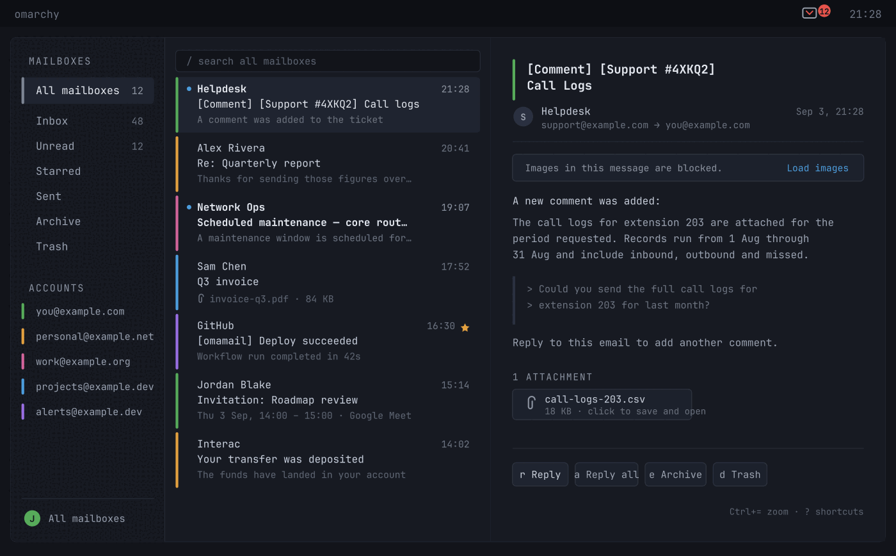

# Omail — a Gmail and IMAP email client for Omarchy

**Your mail as a native Omarchy window — not a browser tab.**

Omail is an Omarchy desktop email client: a Quickshell plugin that reads,
triages, and answers your mail over the official Gmail API, or over IMAP and
SMTP for every other mailbox. It runs inside the `omarchy-shell` process you
already have, follows your active theme, and puts an unread count in the bar.

Works with **Gmail**, **Fastmail**, **iCloud Mail**, **Outlook**, **Yahoo**,
**Zoho**, **GMX**, **Proton Mail** (through its Bridge), and any other IMAP
server — including one you run yourself.

> Originally forked from [huacnlee/omamail](https://github.com/huacnlee/omamail)
> by [Jason Lee](https://github.com/huacnlee), whose work is the foundation this
> is built on. This fork adds a unified inbox with per-account colours,
> attachment saving, independent list and message zoom, and a number of IMAP
> protocol fixes. See [Credit](#credit).

## Features

- **Designed, not assembled.** Monospace, square-cornered, and built to sit
  inside Omarchy rather than to look like a web app in a window. Three columns
  when there is room, one when there is not, and nothing on screen that is not
  your mail.
- **Gmail and IMAP.** Sign in to Gmail with Google directly, or add any IMAP
  mailbox with an address and an app password. Several accounts at once, each
  with its own inbox, cache and unread count.
- **Every mailbox in one list.** "All mailboxes" merges every account's Inbox —
  or Unread — into a single list, newest first, and a coloured bar down the
  leading edge of each row says which mailbox it came from. The colour is
  chosen per account on the settings page from a fixed set, so two mailboxes
  are never told apart by shades nobody can distinguish. Replying answers from
  the account that received the message, not the one on screen.
- **Attachments you can open.** Click an attachment to save it to your
  downloads directory and hand it to the desktop. The filename comes from the
  sender, so it is reduced to a single path component before anything touches
  the disk, and an existing file is never overwritten.
- **Keyboard-first.** `j`/`k` to move, `e` to archive, `s` to star, `r` to
  reply, `c` to compose, `Alt+1`…`0` for the mailboxes — hold Alt and the rail says
  which is which — `Alt+A` to switch account, `/` to search, `?` for the rest.
- **Sized for how you read.** `Ctrl+=` and `Ctrl+-` size the pane you are in.
  The open message and the list keep separate sizes, because a message is read
  and a list is scanned — a dense list beside a large message is a real way to
  work on a wide screen. Both survive a close.
- **Always counting.** The unread badge keeps working while the window is shut,
  for every account, with a desktop notification when new mail lands.
- **One window.** Read, archive, star, trash, search, and answer without a
  second window taking a region of its own.
- **Invitations you can answer.** A meeting invitation is read out of the
  message's own calendar part and drawn as a meeting: when it runs, in your
  clock rather than the organiser's, how long for, where, whether it repeats,
  and who else has said yes. **Yes**, **Maybe** and **No** answer the
  organiser, and a Google Meet link joins in one click. It works on every
  mailbox here, not only Gmail — the answer is an ordinary reply, which is
  what every calendar server is already listening for.
- **Off a list in one click.** A newsletter that supports one-click
  unsubscribing is unsubscribed from without leaving the window. One that only
  offers an address gets a message; one that only offers a page says so before
  it opens your browser. Nothing is ever fetched from a sender's address until
  you ask.
- **Images stay blocked.** Loading a sender's pictures tells them the mail was
  read, from which address and when. They load when you ask, for that one
  message.
- **Your theme.** Every colour comes from the active Omarchy theme, so the
  mailbox changes the moment the desktop does.
- **Keyring-backed.** The Gmail refresh token and every IMAP password live in
  GNOME Keyring — never in a config file, never on a command line.



*Five mailboxes merged into one list. The bar down each row — and beside each
address on the rail — is the account it arrived in.*


And with mini size mode:

 

## What it is

Three parts, one plugin:

- an **unread badge** in the bar, which keeps counting whether or not the
  window is open
- an **application window** — a real Hyprland window, tiled like any other,
  with your mailboxes, the message list, and the reader side by side
- **compose and reply inside that same window**, because a second window would
  take a region of its own under Omarchy's panel mechanism

## Add it to Omarchy

```bash
omarchy plugin add https://github.com/jonathangeller/omail.git --enable
```

Then click the envelope in the bar. To open it from the keyboard, add this to
`~/.config/hypr/bindings.lua`:

```lua
  o.bind("SUPER + SHIFT + G", "Omail", "omarchy shell shell toggle omail '{}'")
```

The target is `shell`, not the plugin id: the window is summoned by the shell,
which is what loads it in the first place. A plugin-scoped target would have to
be registered by code that is only running once the window is already open.

Requires Omarchy 4, plus `socat`, `secret-tool`, `openssl`, `xdg-open` and
`curl` — all of which Omarchy already ships.

## Mailboxes it can open

Adding a mailbox asks which kind first, because the two setups have nothing in
common.

**Gmail** signs in with Google directly. Google issues Gmail API access per
project, so this route needs an OAuth client you create once — the setup page
walks through it. In exchange it gets labels, conversations, Gmail's own search
syntax, and a "report spam" that Google actually learns from.

**IMAP** is an address and a password. Fastmail, iCloud, Zoho, Outlook, GMX,
Proton via its Bridge, or a server of your own: the servers are filled in from
the address for the ones this knows, and shown behind a disclosure so they can
be corrected for the ones it does not. Most providers want an *app password*
rather than the one you sign in to their website with, and the form says so
before you find out the hard way.

What IMAP does not have, the panel does not offer: no labels, no server-side
conversations, no "report spam" — moving a message to a Junk folder teaches a
server nothing, and a button that quietly meant that would be a promise this
could not keep. Archive appears only when the server has an archive folder to
move to. Sending goes out over SMTP, or the mailbox is read-only if no SMTP
server is set.

**HEY** is listed as a future integration. A HEY CLI is reportedly in
development; once it is ready, Omail can support it through the provider seam
that is already in place.

## Upgrading from Omamail

The plugin was called `omamail`, and before that `omarchy-gmail`. Installing or
running `./install.sh` moves `~/.config/omamail` and `~/.cache/omamail` to the
new names, and the keyring lookup falls back to the old service names once and
rewrites what it finds — so accounts, the OAuth client and both kinds of stored
secret survive without being re-entered. A store already under the new name is
never overwritten by an older one.

The plugin id is the one thing this repository cannot move for you. It is
recorded in `~/.config/omarchy/shell.json`, which belongs to your shell rather
than to the plugin, so a bar widget placed under the old id has to be replaced:

```bash
omarchy plugin remove omamail
omarchy plugin add https://github.com/jonathangeller/omail.git --enable
```

To remove it:

```bash
omarchy plugin remove omail
```

That takes the plugin itself. Nothing it wrote lives inside your Omarchy
config, so removing those is separate and entirely up to you:

```bash
secret-tool clear service omail    # the refresh token and IMAP passwords
rm -rf ~/.config/omail             # the OAuth client and account list
rm -rf ~/.cache/omail              # cached mail
```

Signing out from inside the app clears the keyring entry on its own. The plugin
never edits your shell, Hyprland or theme configuration — the one keybinding
above is yours to add and yours to remove.

## Connecting your mailbox

Gmail has no shared application to sign in through. Google issues API access
per Cloud project, so Omail signs in with an OAuth client **you own**.
The window walks you through it in five steps, each with the console page one
click away. It takes about two minutes, once.

The step people skip, and the one that decides whether the sign-in lasts:
**press "Publish app"** on your own project. A project left in Testing is
issued refresh tokens that expire after seven days, so the app would sign you
out every week. Publishing shows an "unverified app" warning once — expected
for a client you made yourself, since you are the developer and the only user.

If you have the `gcloud` CLI, `scripts/google-cloud-setup.sh` does the two
steps that have an API — creating the project and enabling Gmail — and opens
the console on the rest with the project already selected. The consent screen
and the client itself are console-only; there is no CLI for them.

> **Why isn't a client built in?** `gmail.modify` and `gmail.send` are
> *restricted* scopes. Shipping a client would mean this project completing
> Google's OAuth verification first; until then it would be stuck in Testing,
> handing every user a seven-day session. The code is ready for one —
> `Credentials.BUILTIN` is a single constant — and your own client always wins
> over it.

## Using it

| Key | What it does |
| --- | --- |
| `j` / `k` | Move down / up |
| `Enter` or `o` | Open the selected message |
| `Esc` | Back to the list; close the window from the list |
| `e` | Archive |
| `d` | Move to trash |
| `s` | Star or unstar |
| `Shift+I` / `Shift+U` | Mark read / unread |
| `r` / `a` / `f` | Reply, reply all, forward |
| `c` | Compose |
| `Ctrl+Enter` | Send |
| `/` or `Ctrl+K` | Search |
| `Alt+1` … `Alt+0` | The mailbox with that number on the rail |
| `Alt+A` | Switch account |
| `Ctrl+=` / `Ctrl+-` / `Ctrl+0` | Zoom the pane you are in, or reset it. The list and the open message keep their own sizes; the focused one is what changes |
| `F5` | Check for mail |
| `Ctrl+?` | Every shortcut |

Search takes Gmail's own operator syntax straight through — `from:jane`,
`has:attachment`, `older_than:7d`. The Unread mailbox is scoped to Primary:
category tabs do not remove the `INBOX` label, so an unread filter without that
scope returns the whole promotional backlog rather than the mail you have not
read. Right-click any row in the list for archive,
trash, spam, star and read/unread without leaving the keyboard cursor behind.

## What it does not do

- **No embedded browser.** Message bodies render through Qt's own rich text
  engine, which handles the HTML-4-and-inline-styles subset that real mail is
  written in. A browser engine cannot be embedded in a plugin at all:
  `QtWebEngineQuick::initialize()` has to run before the host process builds
  its `QGuiApplication`, and a plugin loads long after that.
- **No attachment previews.** An attachment is saved and handed to the desktop
  to open; nothing is rendered inside the window.

Remote images in a message body are blocked until you ask for them, and asking
covers that one message. Qt really does fetch an ``, so
loading a message's pictures fires whatever tracking pixels it carries and tells
the sender when the mail was read — which is why it is a decision rather than a
default. Images pointed at this machine or at the network around it (loopback,
private addresses, `.local` names, `file:`) are never fetched at all, however
often you ask: a message must not be able to make the client knock on the door
of something listening on your own network.

Several mailboxes can be added and switched between; each keeps its own cache,
its own refresh token, and its own unread count, and the bar badge counts all of
them. **All mailboxes** in the switcher merges them into one list, newest first, with a coloured stripe saying which mailbox each message arrived in; settings decides which mailboxes it draws from, so a noisy address can be left out of the merged list while still being one row of its own in the switcher. Every mailbox is included until you say otherwise, and one added later joins it. They share one OAuth client, since a client belongs to a Cloud project
rather than to an address — so adding a second mailbox is a sign-in, not another
trip through the console. Mailboxes are added and removed on the settings page,
and switched from the menu, the user bar at the foot of the rail, or `Alt+A` —
which opens the same switcher with the keyboard on the mailbox you are in:
`j`/`k` move, `Enter` or `o` takes one. The same switcher offers **All
mailboxes**, which merges every account's Inbox or Unread into one list and
stripes each row in the colour that mailbox was given on the settings page.
Archive, trash, star, RSVP and unsubscribe all resolve through the message
rather than the account on screen, so they reach the right server in a merged
list.

The message list, labels and profile are cached per account so switching never
waits on the network. Message bodies are cached one file per message — a
thousand of them, evicted least-recently-used.

## Where your credentials live

- The refresh token goes to **GNOME Keyring**, keyed by client *and* account,
  written over stdin so it never appears in the process table. Two mailboxes
  share one client, so keying by client alone would have let the second sign-in
  overwrite the first.
- The OAuth client goes to `~/.config/omail/credentials.json`, mode
  `0600`. Not to plugin settings — `shell.json` is world-readable.
- The access token exists only in memory.
- Signing out clears the keyring entry.

The app asks for `gmail.modify` and `gmail.send`. `gmail.modify` covers reading,
labelling, archiving and trashing, and deliberately **cannot** delete anything
permanently.

## Development

```bash
./install.sh          # symlink this checkout into ~/.config/omarchy/plugins
make validate         # node tests, source regressions, qmllint, manifest check
```

Working agreements are in [AGENTS.md](AGENTS.md) and the specification is in
[docs/SPEC.md](docs/SPEC.md).

## Credit

Omail is a fork of **Omamail**, created by
**[Jason Lee](https://github.com/huacnlee)** (`huacnlee`) at
[huacnlee/omamail](https://github.com/huacnlee/omamail). The design, the
three-entry-point plugin architecture, the Gmail API and IMAP providers, the Qt
rich-text rendering with remote images blocked, the calendar invitations and
one-click unsubscribe — all of that is his work, and it is what this is built
on.

The fork diverged at upstream's 0.3.0 and adds:

- a **unified inbox** across every account, with a colour per mailbox and a
  stripe on every row
- **attachment saving**, with a sanitised filename and no overwrite
- **independent zoom** for the list and the open message
- IMAP fixes: SASL mechanism selection, capability caching, `SEARCH` result
  ordering, `INTERNALDATE` parsing, connection reuse against servers that
  ration connections, and a `NO`-in-a-header false positive

Both the original and this fork are under the MIT License, and the copyright
notice in [LICENSE](LICENSE) remains Jason Lee's.

Omail is an independent project and is not affiliated with Google.
Gmail is a trademark of Google LLC.

Licensed under the [MIT License](LICENSE).
